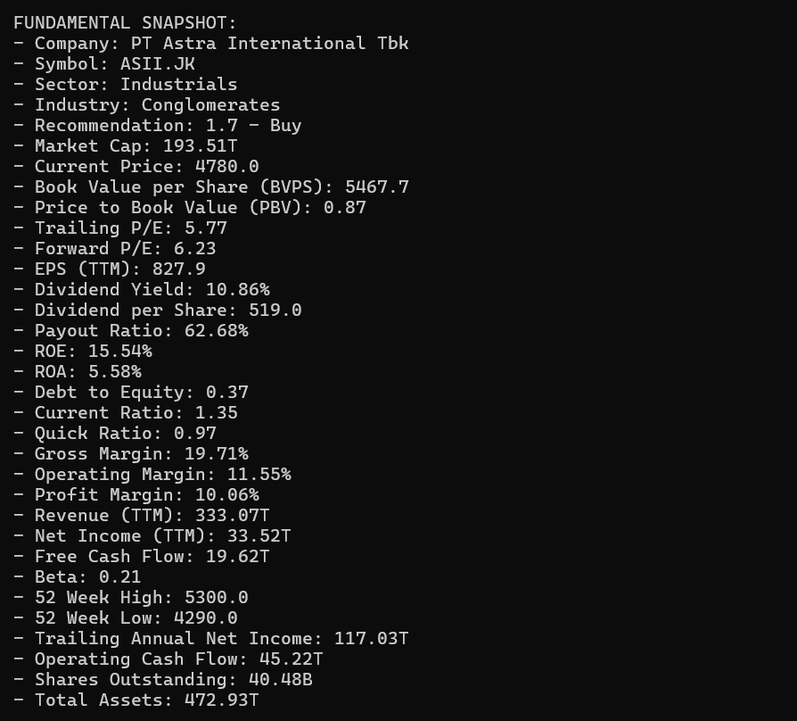

# 📊 Analin

**Analin** (Analisis Indikator) adalah sebuah proyek yang bertujuan untuk menganalisis saham secara **teknikal** dan **fundamental**.  
Proyek ini masih dalam tahap pengembangan dan belum sepenuhnya akurat, namun terus disempurnakan untuk memberikan hasil analisis yang solid.

---

## ✨ Fitur Utama

- 📈 **Analisis Teknikal**  
  Menganalisis pergerakan harga saham menggunakan grafik, tren, dan indikator teknikal populer seperti moving average, RSI, dll.

- 🧾 **Analisis Fundamental**  
  Menggali informasi laporan keuangan perusahaan, rasio penting (PER, PBV, ROE), dan indikator fundamental lainnya.

- 📷 **Visualisasi Data**  
  Menyajikan hasil analisis dalam bentuk grafik dari Matplotlib untuk indikator teknikal.

---

## 🖼️ Contoh Output

### Chart

### Analisis Teknikal

### Analisis Fundamental

---

## 🚧 Status Proyek

> Proyek ini masih dalam tahap **pengembangan awal**.  
> Akurasi analisis akan terus ditingkatkan seiring waktu.

---

## 📌 Rencana Pengembangan

- [ ] Penambahan indikator teknikal lanjutan.
- [ ] Penambahan indikator fundamental lanjutan.

---

## 🤝 Kontribusi

Karena ini proyek satu orang, kontribusi sangat terbuka bagi yang ingin berkontribusi!

---